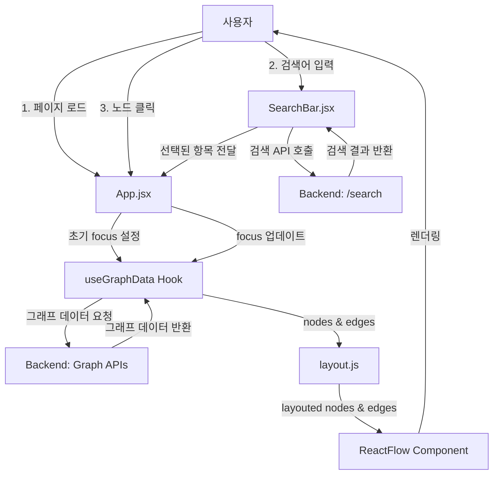
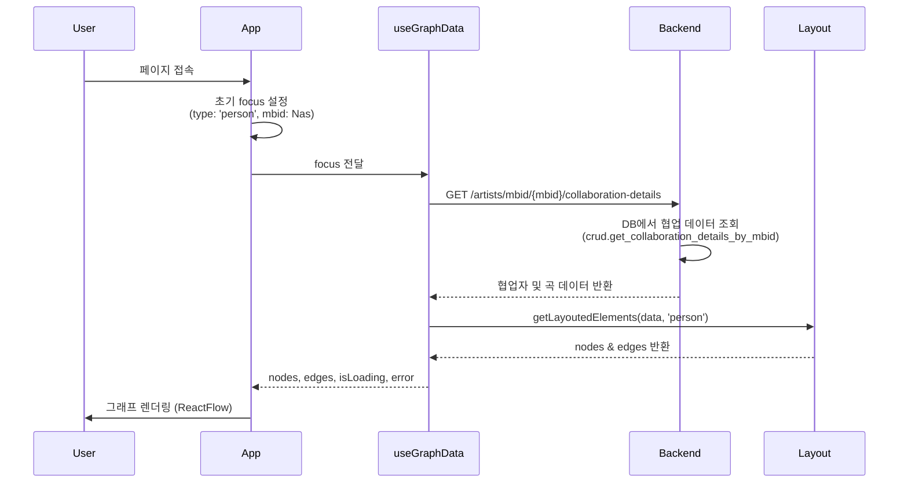
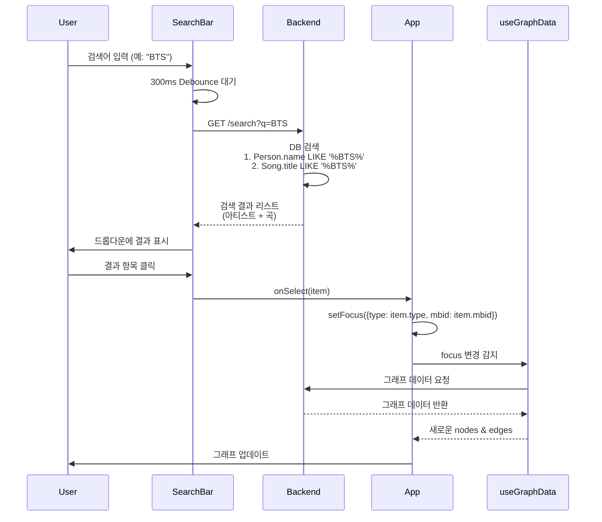
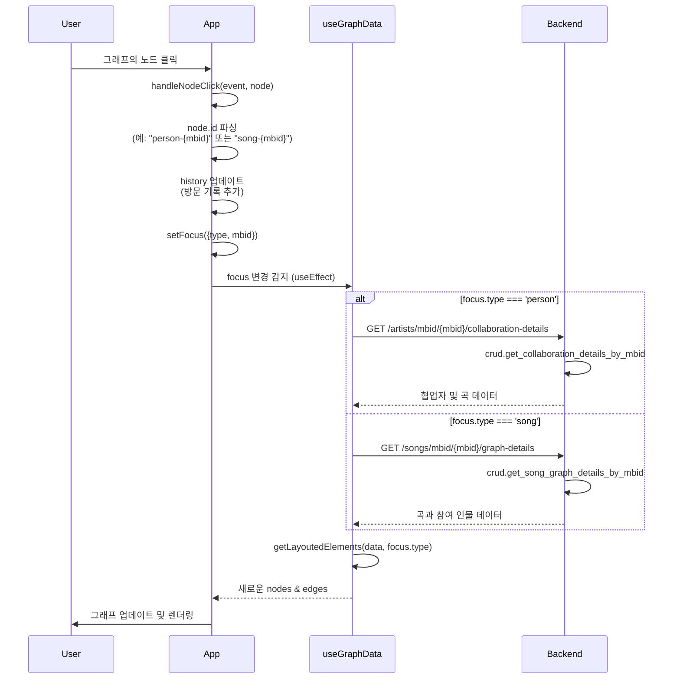
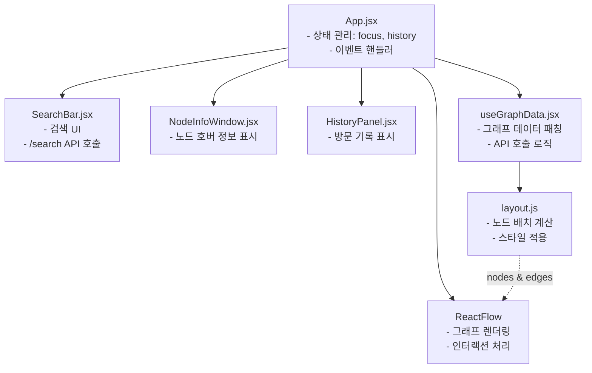
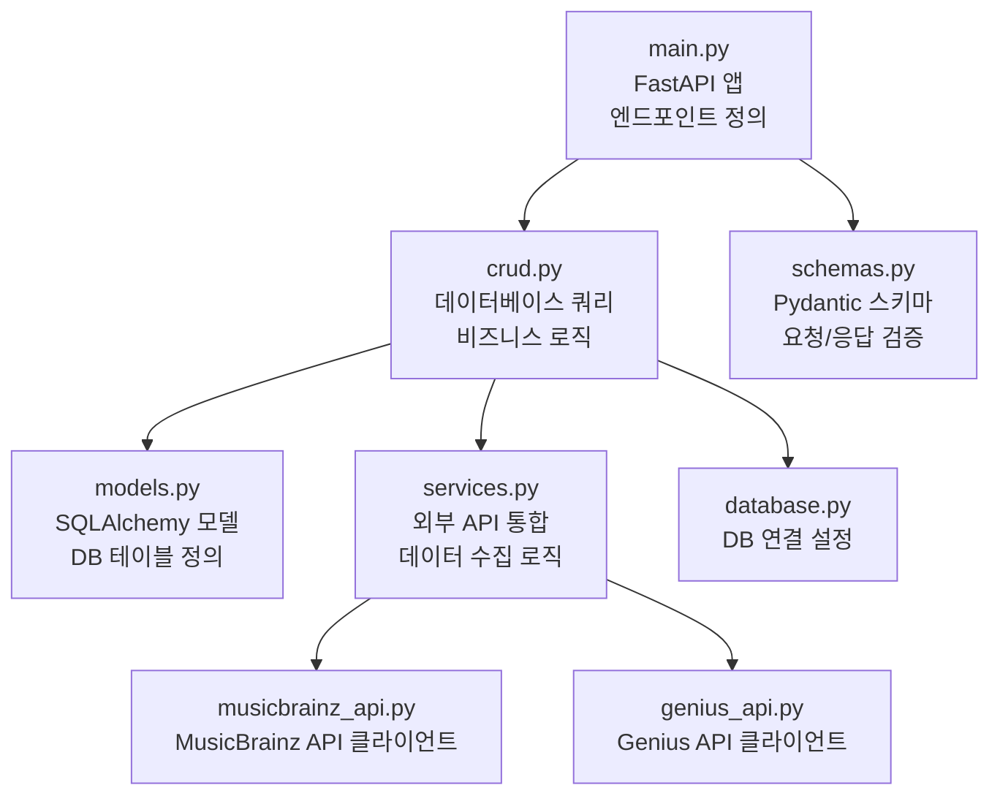

# Frontend-Backend 동작 흐름도

이 문서는 Starlight-Connect 프로젝트에서 Frontend가 어떻게 Backend API를 호출하는지 전체적인 흐름을 설명합니다.

## 시스템 개요

- **Frontend**: React + Vite (포트: 5173)
- **Backend**: FastAPI (포트: 8000)
- **주요 기능**: 음악 아티스트와 곡의 협업 관계를 3D 그래프로 시각화

---

## 전체 아키텍처 흐름도



---

## 주요 흐름 상세 설명

### 1. 애플리케이션 초기화 흐름



**핵심 파일:**
- `frontend/src/App.jsx`: 초기 focus 상태 관리
- `frontend/src/hooks/useGraphData.jsx`: 데이터 패칭 로직
- `backend/app/main.py`: API 엔드포인트 정의 (Line 216)
- `backend/app/crud.py`: 데이터베이스 쿼리 로직

---

### 2. 검색 기능 흐름



**핵심 파일:**
- `frontend/src/SearchBar.jsx`: 검색 UI 및 API 호출 (Line 22)
- `backend/app/main.py`: `/search` 엔드포인트 (Line 228)
- `backend/app/crud.py`: `search_persons_by_name`, `search_songs_by_title` 함수

**API 상세:**
- **Endpoint**: `GET /search?q={query}`
- **Query Parameter**: `q` (검색어, 최소 1자 이상)
- **Response**: 
  ```json
  {
    "results": [
      {
        "id": 123,
        "name": "Artist Name",
        "type": "person",
        "mbid": "artist-mbid",
        "image_url": "...",
        "sub_text": null
      },
      {
        "id": 456,
        "name": "Song Title",
        "type": "song",
        "mbid": "song-mbid",
        "image_url": null,
        "sub_text": "Artist Name"
      }
    ]
  }
  ```

---

### 3. 노드 클릭 흐름



**핵심 파일:**
- `frontend/src/App.jsx`: 노드 클릭 핸들러 (Line 37-54)
- `frontend/src/hooks/useGraphData.jsx`: API 선택 로직 (Line 24-30)

---

## Backend API 엔드포인트 목록

### 그래프 데이터 API

| 엔드포인트 | 메서드 | 설명 | 호출 위치 |
|-----------|-------|------|----------|
| `/artists/mbid/{mbid}/collaboration-details` | GET | 아티스트의 협업자 및 협업 곡 정보 반환 | useGraphData.jsx (Line 25) |
| `/songs/mbid/{mbid}/graph-details` | GET | 곡의 참여 인물 정보 반환 | useGraphData.jsx (Line 27) |
| `/search?q={query}` | GET | 아티스트/곡 검색 (Autocomplete) | SearchBar.jsx (Line 22) |

### 데이터 임포트 API (프론트엔드에서 직접 사용하지 않음)

| 엔드포인트 | 메서드 | 설명 |
|-----------|-------|------|
| `/import/artist-by-name` | POST | MusicBrainz에서 아티스트 데이터 가져오기 |
| `/import/explore-queue` | POST | 연쇄 탐색을 통한 데이터 수집 |
| `/genius/search` | GET | Genius API를 통한 곡 검색 |
| `/import/genius_song` | POST | Genius에서 곡 데이터 가져오기 |

---

## Frontend 컴포넌트 구조



---

## Backend 서비스 구조



---

## 데이터 흐름 요약

1. **초기 로드**:
   - App.jsx가 기본 focus (Nas 아티스트)로 시작
   - useGraphData Hook이 Backend API 호출
   - Backend가 DB에서 협업 데이터 조회 후 반환
   - layout.js가 노드 배치 계산
   - ReactFlow가 그래프 렌더링

2. **검색**:
   - 사용자가 SearchBar에 검색어 입력
   - 300ms Debounce 후 `/search` API 호출
   - Backend가 DB에서 검색 (Person, Song 테이블)
   - 결과를 드롭다운에 표시
   - 사용자 선택 시 focus 업데이트 → 그래프 재로드

3. **노드 클릭**:
   - 사용자가 그래프의 노드 클릭
   - App이 노드 ID 파싱하여 type과 mbid 추출
   - focus 업데이트 및 history 추가
   - useGraphData가 새로운 API 요청
   - 그래프 업데이트

---

## 주요 기술 스택

### Frontend
- **React**: UI 라이브러리
- **ReactFlow (@xyflow/react)**: 그래프 시각화
- **Vite**: 빌드 도구
- **Fetch API**: HTTP 클라이언트

### Backend
- **FastAPI**: 웹 프레임워크
- **SQLAlchemy**: ORM
- **Pydantic**: 데이터 검증
- **MusicBrainz API**: 음악 메타데이터
- **Genius API**: 가사 및 아티스트 정보

---

## 성능 최적화 포인트

1. **Debouncing**: SearchBar에서 300ms debounce로 불필요한 API 호출 방지
2. **조건부 렌더링**: 검색 결과가 있을 때만 드롭다운 표시
3. **에러 처리**: API 실패 시 사용자 친화적 메시지 표시
4. **로딩 상태**: isLoading으로 사용자에게 피드백 제공
5. **CORS 설정**: Backend에서 Frontend origin 허용 (localhost:5173)

---

## 참고 사항

- Backend는 `http://localhost:8000`에서 실행
- Frontend는 `http://localhost:5173`에서 실행
- CORS 설정이 main.py에 정의되어 있음 (Line 16-28)
- 모든 API는 JSON 형식으로 데이터 교환
- MBID (MusicBrainz ID)가 주요 식별자로 사용됨
